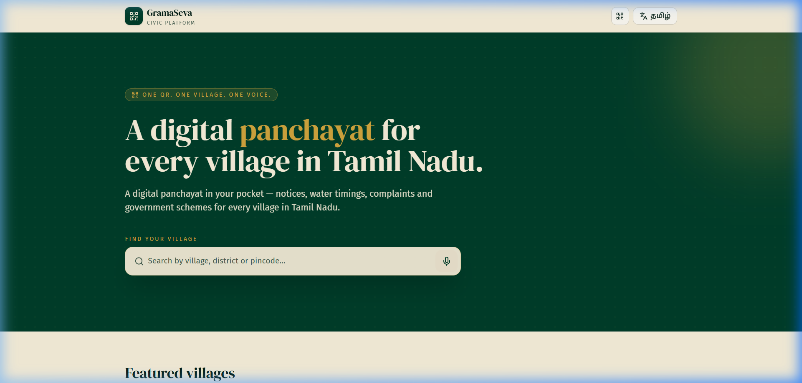
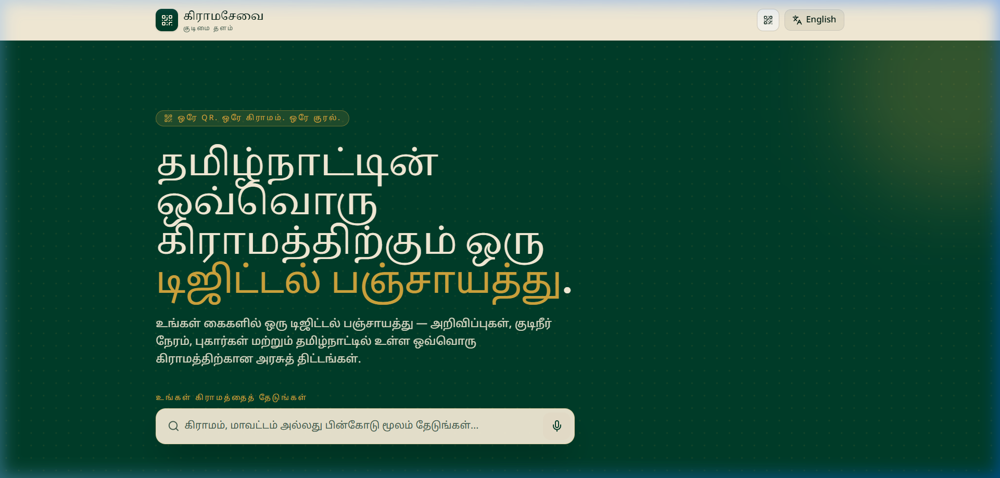
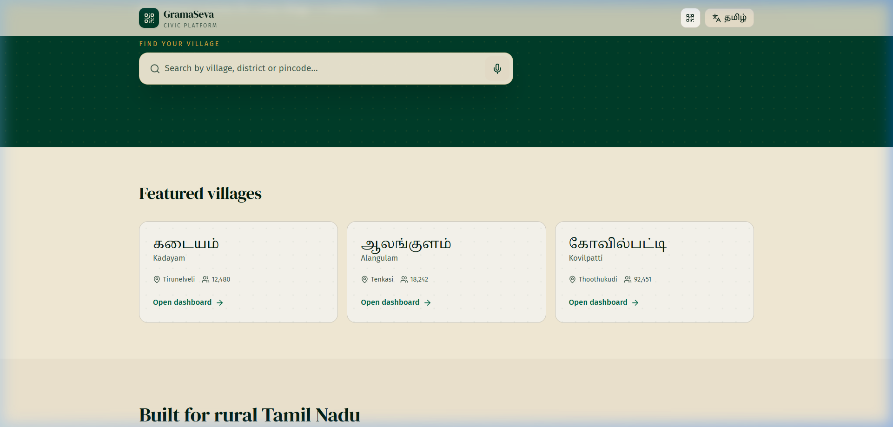
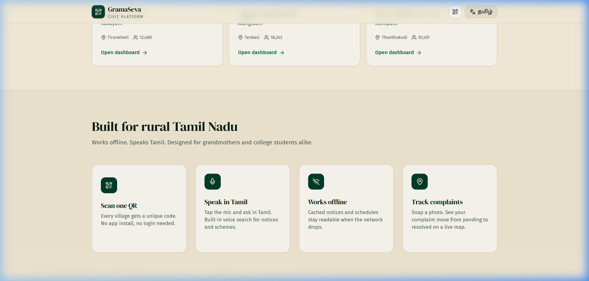

# Grama Connect (கிராமசேவை)

Grama Connect is a specialized civic technology platform designed for rural panchayats in Tamil Nadu. Unlike generic dashboards, it is built with an offline-first, mobile-centric approach to bridge the gap between citizens and local governance.

---

## 🏛 Project Architecture

The project is structured as a professional, scalable **monorepo-style workspace**:

- **`client/`**: The core application, built with React and TanStack Start. It handles all UI, routing, and client-side logic.
- **`server/`**: A dedicated directory for backend logic, API endpoints, and database integrations (Node.js/Express ready).
- **Root**: Contains workspace configurations and helper scripts to manage both environments simultaneously.

---

## 💻 Tech Stack

### Frontend Core
- **React 19**: Utilizing the latest features for performance and stability.
- **TanStack Start (SSR)**: Provides Server-Side Rendering for fast initial loads and SEO-friendly village pages.
- **TanStack Router**: Type-safe routing for complex village navigation.
- **Vite v8**: The engine behind the build process, optimized for rapid development.

### UI & UX
- **Tailwind CSS v4**: Advanced utility-first styling for a premium, responsive look.
- **Leaflet.js**: Integrated mapping system for tracking civic issues (potholes, leaks) at the ward level.
- **Lucide React**: Clean, modern iconography.
- **Radix UI**: Accessible primitive components for modals, carousels, and tooltips.

### Logic & Data
- **Custom i18n**: A lightweight bilingual provider (Tamil/English) tailored for local dialects.
- **Zod**: Runtime schema validation for data integrity.
- **Zustand/Context**: Efficient state management for language and sidebar states.

---

## 📸 Visual Demo

### Landing Page (English / தமிழ்)

### Village Dashboards & Features

## 📦 Module Breakdown

### 1. Routing System (`src/routes`)
- **`index.tsx`**: The main landing page. Features a global search bar for villages, featured panchayats, and platform highlights.
- **`v.$slug.tsx`**: The heart of the platform. A dynamic route that generates a custom dashboard for any village based on its unique slug (e.g., `/v/kadayam`).
- **`__root.tsx`**: The global layout wrapper containing the navigation and the `I18nProvider`.

### 2. Interactive Components (`src/components`)
- **`quick-actions.tsx`**: Manages the four primary citizen tools (Reporting, Schemes, Water, Notices).
- **`feature-actions.tsx`**: Contains the logic for the "Government Scheme Eligibility" engine.
- **`ward-map.tsx`**: A specialized Leaflet component that renders village-specific ward maps with interactive markers.
- **`site-qr-dialog.tsx`**: Generates unique QR codes for every village to facilitate easy offline sharing.

### 3. Library & Utilities (`src/lib`)
- **`i18n.tsx`**: Houses the translation dictionary and language toggle logic.
- **`cn.ts`**: The standard utility for merging Tailwind classes safely.
- **`error-capture.ts`**: Professional-grade SSR error handling for production stability.

### 4. Data Layer (`src/data`)
- **`villages.ts`**: The centralized registry. It contains mock data structured to look like a real database output, including population, president info, and ward-specific notices.

---

## 🛠 Project Standards

- **Modular Design**: Separation of concerns between the TanStack-powered client and the server logic.
- **Type-Safety**: Built with TypeScript and Zod to ensure data integrity across the platform.
- **Performance**: Optimized for fast initial loads using Server-Side Rendering (SSR).
- **Accessibility**: Utilizing Radix UI primitives to ensure high accessibility standards for rural populations.

---

## 🎬 Demo Video

▶️ **[Watch Full Demo on Google Drive](https://drive.google.com/file/d/1YSwP1_Z916mRglqsTKnD80GCDN6GZ2AP/view?usp=sharing)**

---

## 📅 Development History

| Date | Commit Message |
|------|---------------|
| Jun 15 | Initial project setup with workspace config and MIT license |
| Jun 15 | Configure Vite build and TanStack Start SSR setup |
| Jun 16 | Add global layout and bilingual Tamil/English provider |
| Jun 17 | Build landing page with village search |
| Jun 17 | Add citizen quick actions and scheme eligibility engine |
| Jun 18 | Integrate Leaflet ward map for civic issue tracking |
| Jun 19 | Add QR code generation for village pages |
| Jun 19 | Add utility functions and village data registry |
| Jun 20 | Scaffold backend server structure for Node.js/Express |
| Jun 21 | Implement dynamic village dashboard routing |
| Jun 22 | Add core UI components using Radix and Tailwind |
| Jun 23 | Configure routing and entry points for TanStack Start |
| Jun 23 | Add project linting and formatting configuration |
| Jun 24 | Add global site navigation and chrome |
| Jun 25 | Add routes documentation for developer reference |

---

## 🚀 Getting Started
To run the full project:
1. `npm run install:all`
2. `npm run client:dev`

Built with ❤️ for the villages of Tamil Nadu.
